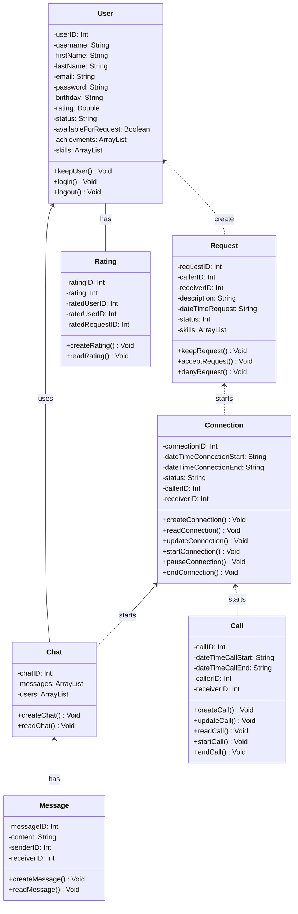

# Ensinativa

<!-- Banner -->

  

## Ensinativa - The idea

Hi, I'm Davi and I developed Ensinativa starting in January 2024. The application is a kind of helpdesk app, but for Mobile. The idea to build it arose during my last semester of my college course in Systems Analysis and Development. Basically, I thought about the problem of having difficulty in solving some common technology problems and often not having a practical search tool, whether to solve a piece of code that AI struggles with, an architectural question, or even a problem with other areas besides programming, like configuring a router.
The solution was to try to create an application that would allow users to quickly expose a doubt so that others could identify it with a description and images quickly, unlike other platforms like forums or AIs.
So, I decided to start building the application with my previous knowledge, but it wasn't an easy task, and I needed to study and improve a lot to implement a first MVP. It was a great challenge and very rewarding to have built something on a larger scope than what I had done before, and something real that can be used and adds value to people's lives.
So without further ado, let's go to the descriptions and specifications of the application:

## Ensinativa - Specs

- Application name: Ensinativa
- Description: Education App
- Architecture: MVVM
- Client side: Kotlin, XML, and HTML
- Security: FirebaseAuth, AppCheck, Play Integrity 
- Backend: All done by Firebase (FirebaseAuth, FirebaseRTDB, FirebaseStorage, AppCheck)
- Testing: SonarLint and SonarCloud
- Deployment: PlayStore
- Kotlin Resources: Views, Activities, Dialogs, Adapters, Framents, ViewBinding, Tasks, Coroutines, Glide, ViewPager.
- Objectives: Solve technology doubts quickly and through mobile devices. In the application, users can create an account and create tickets about technology problems, being able to add images to them. Once this ticket is created, it will appear for other users, and they can accept and start a chat with that person to solve their problem. The idea is to bring everything quickly and dinnamically.

## Ensinativa - How it works

Basically, the application was built in Kotlin and can be downloaded by the user from the PlayStore (Currently awaiting validation of tests from GooglePlay). Once installed, the application runs on the client side and basically needs the Firebase to get nearly all data, whether for authentication, creating requests, conversations, and profile configuration. So it works like an MVVM, but the database is managed by Firebase's own Controller.
About the future: I'll look to implement a lot of new features to the app, like adding video calls in the chats or adding a functional rating system. Expectations are high, and I think this MVP is just the beginning. Of course, everything takes some time, especially alone, but I think it will be very beneficial.

## Ensinativa - Visual Presentation

Below is the video of the application in operation and images of it. Thank you everyone for your attention and support.

 
  
  
  
  

## Implementation Diagram

## Class Diagram 

This diagram made using mermaid helped me when create the Ensinativa objects, it will be more powerfull when I complete the custom API, so there will be more available FR and NFR.

If you have any question or problem, describe it and contact us in this email: davisobrinho82452@gmail.com
