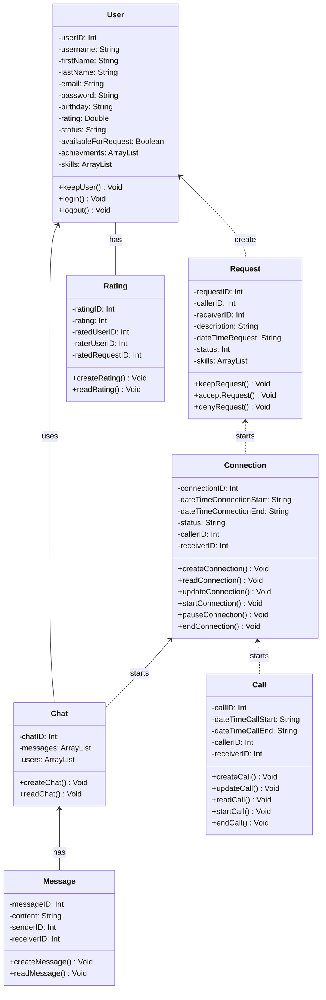

# Ensinativa

## Class Diagram 

```mermaid
classDiagram
    User <.. Request : create
    User <-- Chat : uses
    Connection <-- Chat : starts
    Connection <.. Call : starts
    Request <.. Connection : starts
    Chat <-- Message : has
    User -- Rating : has
    class User{
      -userID: Int
      -username: String
      -firstName: String
      -lastName: String
      -email: String
      -password: String
      -birthday: String
      -rating: Double
      -status: String
      -availableForRequest: Boolean
      -achievments: ArrayList<Achievments>
      -skills: ArrayList<Skills>
      +keepUser() Void
      +login() Void
      +logout() Void
    }
    class Request{
      -requestID: Int
      -callerID: Int
      -receiverID: Int
      -description: String
      -dateTimeRequest: String
      -status: Int
      -skills: ArrayList<Skills>
      +keepRequest() Void
      +acceptRequest() Void
      +denyRequest() Void
    }
    class Rating{
      -ratingID: Int
      -rating: Int
      -ratedUserID: Int
      -raterUserID: Int
      -ratedRequestID: Int
      +createRating() Void
      +readRating() Void
    }
    class Chat{
      -chatID: Int;
      -messages: ArrayList<Message>
      -users: ArrayList<User>
      +createChat() Void
      +readChat() Void
    }
    class Message{
      -messageID: Int
      -content: String
      -senderID: Int
      -receiverID: Int
      +createMessage() Void
      +readMessage() Void
    }
    class Connection{
      -connectionID: Int
      -dateTimeConnectionStart: String
      -dateTimeConnectionEnd: String
      -status: String
      -callerID: Int
      -receiverID: Int
      +createConnection() Void
      +readConnection() Void
      +updateConnection() Void
      +startConnection() Void
      +pauseConnection() Void
      +endConnection() Void
    }
    class Call{
      -callID: Int
      -dateTimeCallStart: String
      -dateTimeCallEnd: String
      -callerID: Int
      -receiverID: Int
      +createCall() Void
      +updateCall() Void
      +readCall() Void
      +startCall() Void
      +endCall() Void
    }
```
